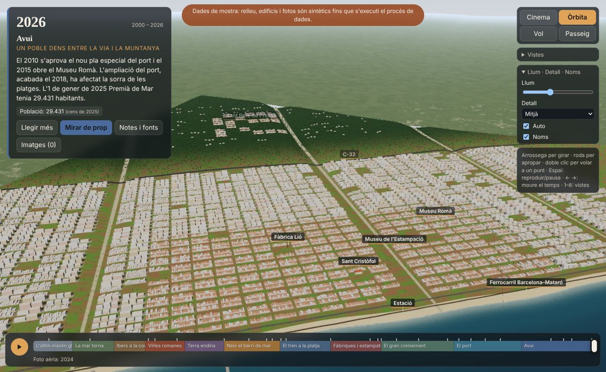

# Premià de Mar a través del temps

**Live:** https://teclliure.github.io/premia-timeline/

Interactive 3D timeline of Premià de Mar (Maresme, Catalonia), from the Last Glacial Maximum to
today. Scrub the year and watch the sea level, the beach, the fields and the town change.
Modelled on [Ronda a través del tiempo](https://ruben-aguilar.github.io/ronda-timeline/) by Rubén
Aguilar: same architecture (Python data pipeline → static files → Three.js), new code.



The data in `public/` is real: ICGC terrain (MET 5 m) and orthophotos (1946, 1956, 1983–89,
1994–97, 2004–05, current + 0.5 m centre), EMODnet bathymetry, Catastro buildings, OpenStreetMap
features and Wikimedia Commons photos. It is built by the **Build real data** GitHub Actions
workflow (Actions → Build real data → Run workflow), which runs `scripts/run_all.sh`, commits
`public/` and redeploys the site. The *steps* input runs a subset, e.g. `fetch_osm gallery`.
`scripts/make_placeholder.py` still produces offline sample data for development.

## Run

```bash
npm install
npm run dev        # http://localhost:5173
npm run build      # static site in dist/ (base "./", works under any GitHub Pages path)
npm run shot       # screenshots with headless Chrome + Playwright -> shots/
```

URL state: `#year=1848&cam=x,y,z,tx,ty,tz` (also `&h=19` for the hour, `&view=port` for a preset
view, `&mode=walk`). The hash updates while you scrub, so any moment can be shared.

Pushing to `main` deploys to GitHub Pages through `.github/workflows/pages.yml`
(Settings → Pages → Source: GitHub Actions).

## Data pipeline (`scripts/`, needs [uv](https://docs.astral.sh/uv/))

`scripts/run_all.sh` runs everything in order. The box is set in `scripts/aoi.py`
(4 × 4 km in ETRS89 / UTM 31N, centre ~1 km inland of the beach, so ~1 km of sea is included;
inner high-res box over the centre, seafront and railway).

| Script | Output |
|---|---|
| `fetch_raster.py` | DEM (ICGC, fallback IGN MDT05), EMODnet bathymetry and the orthophoto of each era (1946, 1956, 1973–86, 1990s, 2004, current) in `raw/`. `list` prints the WMS layers each service offers |
| `fetch_hires.py` | current ortho at 0.5 m for the inner box |
| `fetch_osm.py` | railway, N-II, C-32, breakwaters, harbour, beaches, named places → `features.json` |
| `export_terrain.py` | merged land + sea DEM → `dem.bin` (Int16 dm, negative = seabed), era textures, `manifest.json` |
| `process_buildings.py` | Catastro INSPIRE footprints + floors + estimated year → `buildings.json`, `urban_year.png` |
| `coastline.py` | shoreline offset per era and coastal segment → `coastline.json`, `shore.png` |
| `make_landscape.py` | pre-urban landscape texture, trees detected in the current ortho, era crops → `trees.bin` |
| `gallery.py` | freely licensed historical images (Wikimedia Commons, plus `gallery_manual.json`) |
| `grid_view.py` | ortho window with a local-metre grid, zones and POIs, for drawing `zones.json` |
| `make_placeholder.py` | the sample data |

**Places.** `src/places.ts` lists the places with a history card (Can Manent, the gas works /
Museu de l'Estampació, Fàbrica Lió, Can Gravada, Carrer Aurora, Sant Cristòfol): dated events and
sources from the Diputació de Barcelona heritage inventory, texts in `src/locales/ca.json`, and a
freely licensed Commons photo per place (`gallery.py` → `data/places.json`, author and licence shown).
Labels of these places are clickable, and the era card lists the ones that exist in that era.

**Building years.** Catastro has no years before ~1900 and often stores the last renovation.
Inside the hand-drawn historic zones of `scripts/zones.json` (to be drawn over the 1946/1956 photos; empty until then, the sample-data drafts are in `zones_placeholder.json`)
the year is a per-zone estimate that grows outwards from a seed point and is never later than
the Catastro year; outside them the Catastro year is used. The app's *Notes i fonts* panel says
this. **The zones in the repo are a first draft drawn over the 1946 flight — refine them** with
`grid_view.py 1946 …` once the real orthophotos are in `raw/`.

Manual overrides: `scripts/pois_manual.json` (POIs missing in OSM), `scripts/coastline_manual.json`
(shorelines before 1946 or bad automatic picks), `OVERRIDES` in `process_buildings.py` (dated buildings).

### Not verified against the live services

This was written in an environment without access to the data services, so the first real run
needs checking: the ICGC WCS/WMS paths and layer names (resolved from GetCapabilities, and
`fetch_raster.py list` shows what exists), the EMODnet coverage id `emodnet__mean`, the Catastro
ATOM feed URL, and the Commons category names.

## Code (`src/`)

- `timeline.ts` – non-linear time scale, eras, milestones with sources, census figures, sea-level curve
- `ground.ts` – DEM texture + shoreline shift shared by the terrain, the sea and the CPU (picking, camera)
- `terrain.ts` – 8 × 8 LOD tiles with skirts + far ring; per-year orthophoto blend, pre-urban landscape, exposed shelf
- `sea.ts` – animated water at the year's sea level, depth colour and surf
- `buildings.ts` – one merged mesh sorted by year (draw range = past buildings only), growth, windows, tiled roofs / terrats
- `trees.ts` – instanced trees, orchards and vines per tile, alive between their years
- `landmarks.ts` – railway + train, N-II, C-32, port, Sant Cristòfol (1798 / 1936 / 1939), chimneys, Roman villa, boats, labels
- `camera.ts` – Cinema, Orbit, Fly, Walk, preset views, fly-to
- `ui.ts`, `gallery.ts`, `sky.ts`, `i18n.ts` – interface, lightbox, light by hour, strings

All strings are in `src/locales/ca.json`. To add Spanish or English, copy it to `es.json` /
`en.json` and register it in `src/i18n.ts`.

**Controls.** Space play/pause · ←/→ move in time (Shift = bigger steps) · 1–8 views ·
double-click flies to a point · Fly: drag + W A S D, Q/E up/down · Walk: drag + W A S D, Shift to run.
*Llum* sets the hour, *Detall* the quality, *Noms* the labels; *Auto* lowers the quality when frames are slow.

**Performance.** Distance-based terrain LOD, trees culled per tile, future buildings outside the
draw range, shadow map only redrawn when the scene changes, no frames drawn while Orbit is idle.

## Timeline content and sources

Every milestone in `src/timeline.ts` cites a source; approximate years are flagged (`estimate`).
Main sources: Inventari del Patrimoni Cultural (Diputació de Barcelona) records for Sant Cristòfol,
the Rectoria, the Fàbrica Lió, Vallpremià and Els Frigorífics; ICAC (Can Ferrerons villa);
Ajuntament de Premià de Mar (port history, Torrassa competition brief, Museu de l'Estampació);
Lambeck et al. 2014 and Clark et al. 2009 (sea level); Wikipedia (census figures, C-32).
One suggestion from the original brief was dropped: no watchtower is documented in Premià de Mar
(Ajuntament, Torrassa brief), so none is drawn.

## Licences and attribution

ICGC (CC BY 4.0), IGN (CC BY 4.0), EMODnet Bathymetry (CC BY 4.0), Dirección General del Catastro,
© OpenStreetMap contributors (ODbL), Wikimedia Commons (per image), Three.js (MIT).
Materials are procedural for now; Poly Haven (CC0) textures are planned but not yet downloaded.
The code has no licence yet — choose one before publishing.
